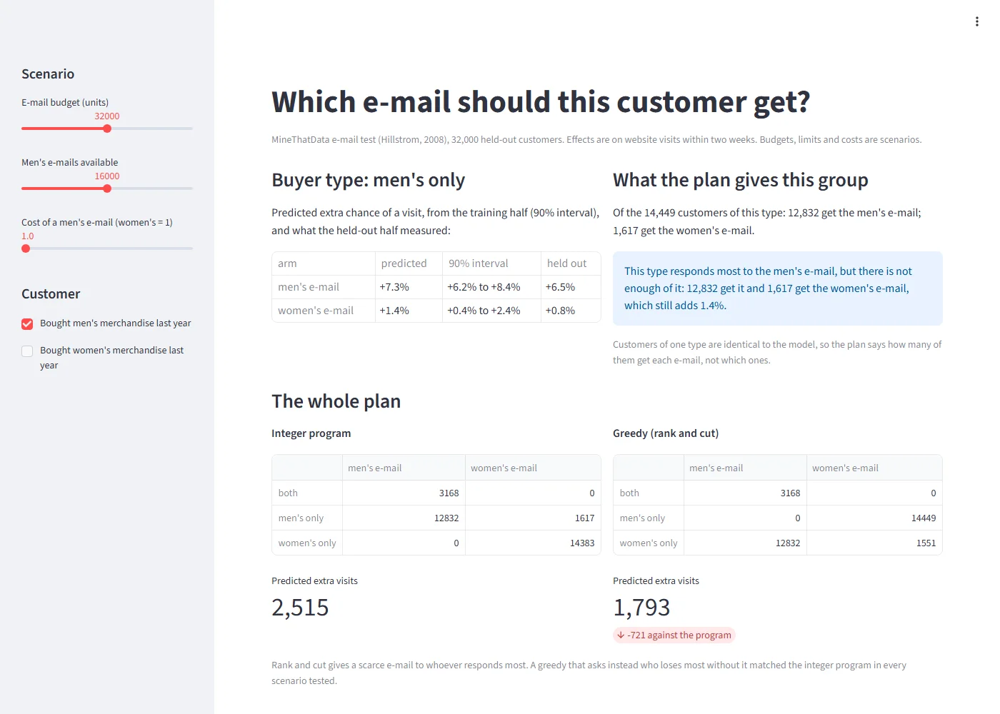

# Which e-mail should this customer get?

A demo of the allocation in **Promotion Uplift and Bandits**. Set an e-mail
budget, how many men's e-mails are available and what one costs, describe
a customer, and the app re-solves the plan: which e-mail that customer's
group gets, and how the plan compares with ranking customers by response.

Live: https://promo-uplift-demo.streamlit.app/

Project write-up: https://azaryamarcello.vercel.app/projects/promo-uplift



## Run it

```
pip install -r requirements.txt
streamlit run app.py
```

Data: the MineThatData e-mail test (Kevin Hillstrom, 2008). Only the
aggregated effects in `data/demo_group_effects.csv` are included.
